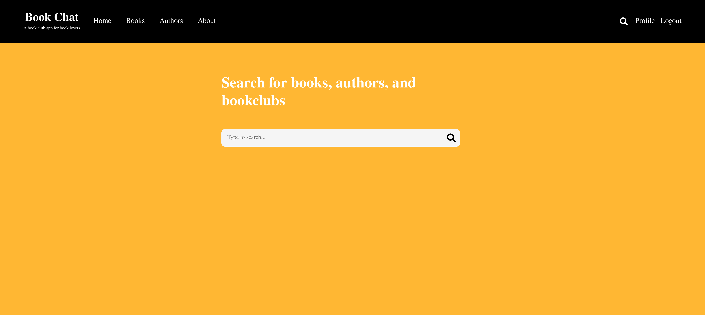
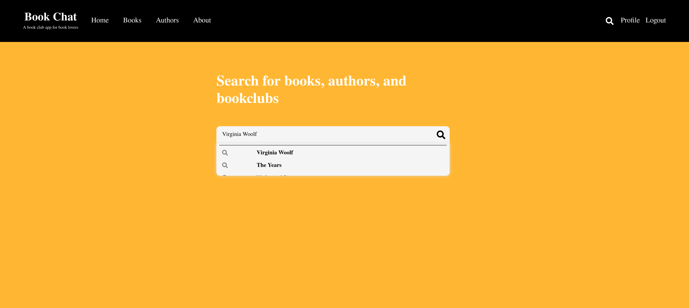
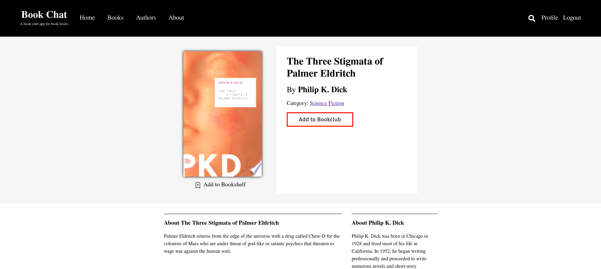
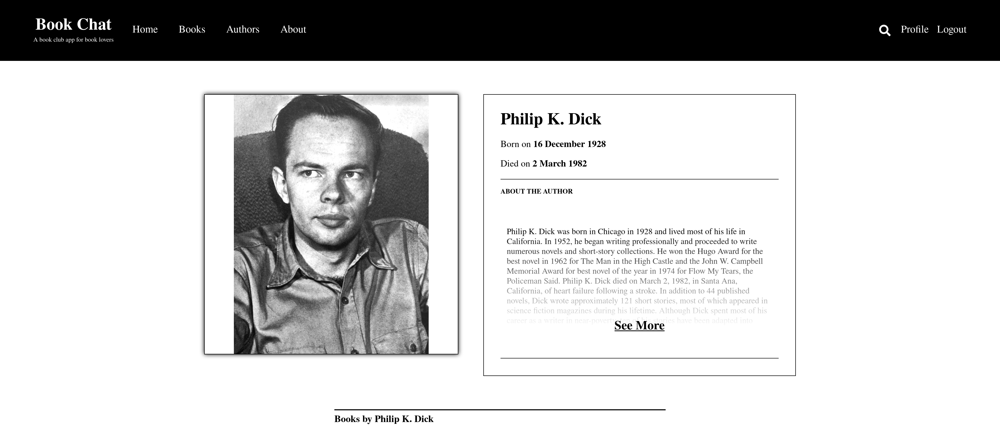
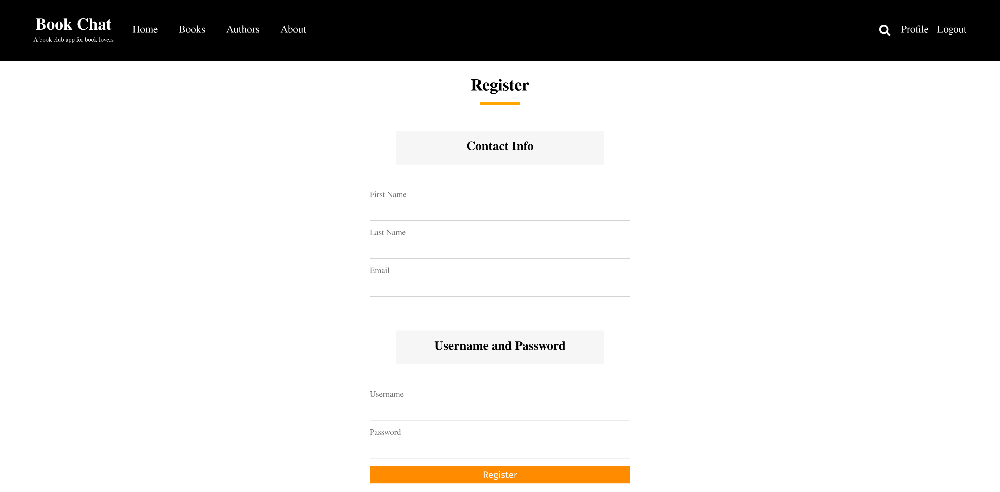
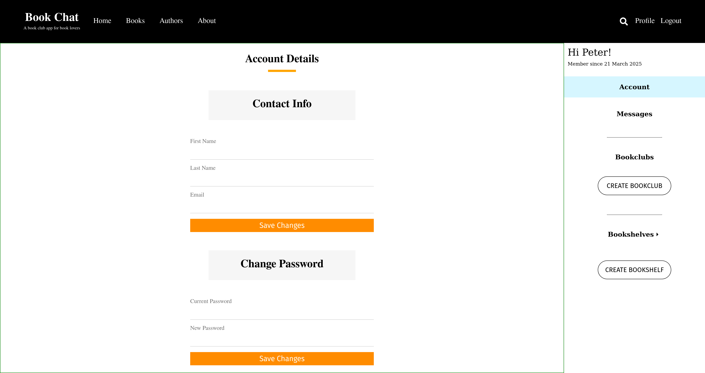
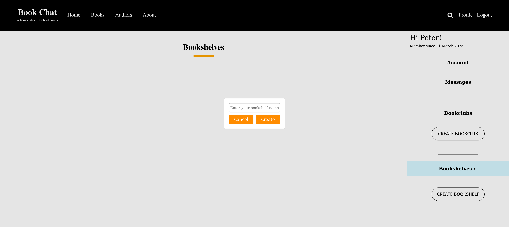
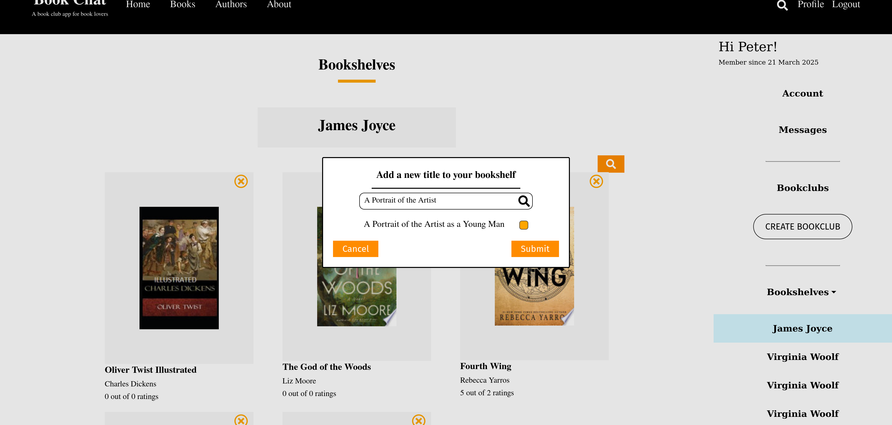
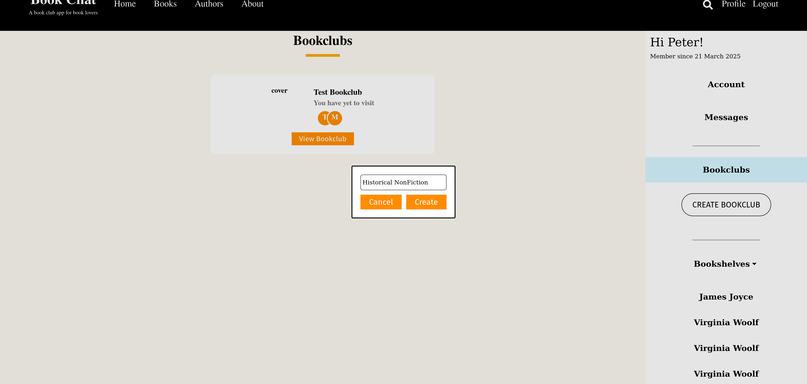
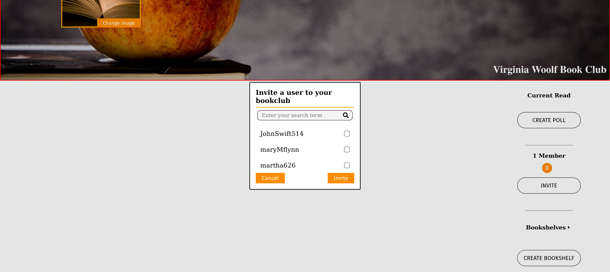

# Welcome to Bookchat

This repository contains the source code for Bookchat, a bookclub app for lovers of the written word. Bookchat was designed to facilitate community learning around a shared love of books for users from across the globe. The app was built with Typescript, React, and Django.

[Introduction](#introduction) • [Installation](#installation) • [Documentation](#documentation) • [Issue?](#issue)

## Introduction

Bookchat is a full-stack social platform designed to bring people together through a shared love of reading. Inspired by my experience teaching English literature at UCLA during the pandemic and running a philosophy book club with friends, Bookchat makes it easy to build community around books — no matter where you're from.

With Bookchat, users can:

 + Discover books across a variety of genres
 + Create and join bookshelves and bookclubs
 + Add books to personal or shared spaces
 + Collaborate with club members using polls to choose the next read
 + Invite others to participate in ongoing discussions

Future features will include:
  + A smart bookclub recommendation algorithm
  + Event scheduling
  + Integration with Zoom and Google Meet

📚 For more details on how to get started, head to the [Documentation](#documentation). Happy reading!

## Installation


### 🔧 Prerequisites

- Python 3.10+
- Node.js 18+
- PostgreSQL (optional for production)
- Django Rest Framework
- Redis (for Django Channels WebSocket support)
- Redux Toolkit
- [pip](https://pip.pypa.io/en/stable/installation/) and [virtualenv](https://virtualenv.pypa.io/en/latest/)

---

## 🧠 Backend (Django)

### 1. Clone the Repository
```bash
git clone https://github.com/your-username/your-repo.git
cd your-repo/backend
```
### 2. Create and Activate a Virtual Environment
```
python -m venv venv
# On Windows
venv\Scripts\activate
# On macOS/Linux
source venv/bin/activate
```
### 3. Upgrade pip (optional but recommended)
```
python -m pip install --upgrade pip
```
### 4.  Install Dependencies
```
pip install -r requirements.txt
```
### 5.Apply Migrations
```
python manage.py migrate
```
### 6. Load Demo Data
```
python manage.py loaddata finished_bookchat.json
```
### 7. Run the Django development server
```
python manage.py runserver
```

## 💻 Frontend Setup (/frontend)

### 1. Navigate to the frontend directory
```
cd frontend
```
### 2. Install Node dependencies
```
npm install
```
### 3. Start the Vite development server
```
npm run dev
```

## Documentation

### 1.Begin by searching for your favorite books


Start by entering a book title, author, or keyword in the search bar. Click on a result to view the book’s dedicated detail page:



From the book page, you can also explore the author’s profile and browse other books they’ve written:



You can always discover the latest books and authors using the links in the navigation bar.

### 2. Register and explore the userdashboard

To get started, navigate to the home page and register for an account:



After creating your account, you'll be redirected to your personal user dashboard:



### 3. Create a bookshelf and add books to it.

In the right-hand sidebar of your dashboard, you’ll find buttons to create bookshelves and bookclubs.

To create a bookshelf, click “Create Bookshelf” and enter a name for your new shelf:



Once your bookshelf is created, you can search for books and easily add them to your shelf:



### 4. Create a bookclub and invite other users

Click on “Create Bookclub” and provide a name for your club:



After setting up your bookclub, invite members by clicking the “Invite Members” button and searching for users you'd like to add:



Once your bookclub has at least three books on its shelf and a few members, you’ll be able to create polls to decide your next group read.


## Issue
If you like what you see, please give us a star.

This app is actively maintained, and we welcome all feedback.

Please raise an issue [here](https://github.com/tascapeter514/bookchatapp/issues/new).
